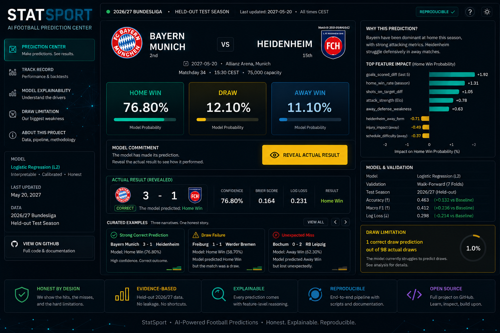

# StatSport — Explainable Football Match Prediction



> Turning historical Bundesliga results into an honest, reproducible, explainable match-prediction portfolio project.

**Status:** Complete portfolio project  
**Type:** University-level AI / data science portfolio project  
**Scope:** Football-Data.co.uk Bundesliga data, 2020/21-2024/25  
**Model:** Home-advantage baseline vs. multinomial Logistic Regression

## Project Overview

StatSport is a bounded machine-learning portfolio project. It takes historical Bundesliga match
results from Football-Data.co.uk, builds leakage-safe pre-match features, compares a simple
home-advantage baseline with multinomial Logistic Regression, and explains the selected model with
coefficient-based global and local explanations.

The goal is not to build a betting tool or maximize prediction accuracy. The goal is to demonstrate a
complete, defensible workflow: data acquisition, processing, feature engineering, modelling,
evaluation, explainability, reproducibility, and clear communication.

## What This Project Demonstrates

- Data acquisition and provenance for a public real-world sports dataset.
- Deterministic data processing and feature engineering.
- Leakage-safe rolling features based only on prior matches.
- A mandatory baseline before selected-model claims.
- Honest baseline-versus-model evaluation on chronological splits.
- Native explainability for an interpretable selected model.
- Reproducible scripts and evidence documents suitable for portfolio review.

## Scope And Non-Goals

StatSport is deliberately small and finished. It is:

- a local analytics and modelling workflow;
- a portfolio artifact for university admissions, internships, and GitHub review;
- bounded to Bundesliga seasons 2020/21 through 2024/25.

It is not a SaaS product, betting product, live prediction service, hosted dashboard, API, large
MLOps project, or research benchmark. The completed v1 project is the reproducible local analytics
and modelling workflow; the Streamlit Showcase UI described below is an optional post-v1 portfolio
presentation layer, not a requirement for reproducing the core results.

## Optional Streamlit Showcase UI

StatSport also includes a local Streamlit Showcase UI as a post-v1 portfolio enhancement. StatSport
v1 remains complete independently of this UI: the data pipeline, baseline, Logistic Regression model,
evaluation, explainability artifacts, and reproduction guide are the core project.

The showcase centers on a read-only Prediction Center:

- held-out 2024/25 Bundesliga matches from the chronological test season;
- a commit-then-reveal interaction, where the model prediction is shown before the actual result;
- baseline vs. Logistic Regression comparison;
- local and global explainability drawn from the completed v1 artifacts;
- explicit draw-class limitation, including the model's failure to correctly predict draws in the
  2024/25 test set.

The showcase is local-only and does not add live data, betting features, accounts, an API, model
serving, or any deployment requirement. It reads already-generated local artifacts and is documented
in [Streamlit Showcase UI evidence](docs/evidence/STATSPORT_STREAMLIT_SHOWCASE_UI_EVIDENCE_v1.md).

## Running The Showcase UI

The Showcase UI runs locally from regenerated project artifacts. A fresh clone can download the
approved public Football-Data.co.uk source CSVs, rebuild the ignored generated outputs, and launch
Streamlit without any account or API key.

macOS/Linux setup:

```bash
python3 -m venv .venv
source .venv/bin/activate
python3 -m pip install --upgrade pip
python3 -m pip install -r requirements.txt
```

Windows PowerShell setup:

```powershell
python -m venv .venv
.\.venv\Scripts\Activate.ps1
python -m pip install --upgrade pip
python -m pip install -r requirements.txt
```

Download the approved raw Bundesliga CSVs, then regenerate the required processed data, evaluation
outputs, and explainability artifacts from the repository root:

macOS/Linux:

```bash
python3 scripts/download_bundesliga_raw_data.py
python3 scripts/process_bundesliga_raw_data.py
python3 scripts/build_bundesliga_features.py
python3 scripts/evaluate_baseline_model.py
python3 scripts/evaluate_logistic_regression_model.py
python3 scripts/build_model_comparison_reports.py
python3 scripts/build_explainability_artifacts.py
```

Windows PowerShell:

```powershell
python scripts/download_bundesliga_raw_data.py
python scripts/process_bundesliga_raw_data.py
python scripts/build_bundesliga_features.py
python scripts/evaluate_baseline_model.py
python scripts/evaluate_logistic_regression_model.py
python scripts/build_model_comparison_reports.py
python scripts/build_explainability_artifacts.py
```

Launch the local Showcase UI:

```bash
streamlit run streamlit_app.py
```

Open [http://localhost:8501](http://localhost:8501). If the app reports missing artifacts, rerun the
download and regeneration commands above from the repository root. The UI is a read-only local
portfolio replay: it uses no live data, betting features, API, account, or hosted service.

## Data

The dataset uses Football-Data.co.uk Bundesliga CSVs:

| Season | Matches |
|--------|--------:|
| 2020/21 | 306 |
| 2021/22 | 306 |
| 2022/23 | 306 |
| 2023/24 | 306 |
| 2024/25 | 306 |
| **Total** | **1530** |

Raw source CSVs are downloaded from Football-Data.co.uk with
`scripts/download_bundesliga_raw_data.py`. Processed data and generated reports are not committed;
they are regenerated locally:

- [Dataset acquisition evidence](docs/evidence/STATSPORT_DATASET_ACQUISITION_EVIDENCE_v1.md)
- [Data processing evidence](docs/evidence/STATSPORT_DATA_PROCESSING_PIPELINE_EVIDENCE_v1.md)
- [Feature engineering evidence](docs/evidence/STATSPORT_FEATURE_ENGINEERING_PIPELINE_EVIDENCE_v1.md)
- [Reproduction guide](docs/guides/STATSPORT_REPRODUCTION_GUIDE.md)

## Prediction Problem

The target is full-time 1X2 result:

- `H`: home win
- `D`: draw
- `A`: away win

The approved chronological split is:

| Split | Seasons | Rows |
|-------|---------|-----:|
| Train | 2020/21-2023/24 | 1224 |
| Test | 2024/25 | 306 |

Walk-forward validation uses three season-blocked folds:

| Fold | Train seasons | Validation season |
|------|---------------|-------------------|
| `walk_forward_1` | 2020/21 | 2021/22 |
| `walk_forward_2` | 2020/21-2021/22 | 2022/23 |
| `walk_forward_3` | 2020/21-2022/23 | 2023/24 |

## Features

The selected model uses only approved core pre-match features:

- home advantage;
- recent form points;
- goals scored;
- goals conceded;
- goal difference;
- home-minus-away difference features for the above rolling metrics.

Rolling features use each team's previous five matches only. The current match result is never used
to create its own features.

## Models

| Model | Purpose | Notes |
|-------|---------|-------|
| Home-advantage baseline | Required reference model | Always predicts `H`; probabilities come from training labels only. |
| Multinomial Logistic Regression | Selected model | Deterministic scikit-learn model with training-only standardization. |

Random Forest was approved only as a fallback if Logistic Regression was not viable. Logistic
Regression was viable, so Random Forest was not implemented.

## Test Results

The selected model improves over the home-advantage baseline on the held-out 2024/25 test season,
but the improvement is modest and should not be overstated.

| Metric | Baseline | Logistic Regression | Delta | Better direction |
|--------|---------:|--------------------:|------:|------------------|
| Accuracy | 0.385620915033 | 0.450980392157 | +0.065359477124 | Higher |
| Balanced Accuracy | 0.333333333333 | 0.395709268591 | +0.062375935258 | Higher |
| Log Loss | 1.094260218009 | 1.063246819064 | -0.031013398945 | Lower |
| Macro-F1 | 0.185534591195 | 0.320700358138 | +0.135165766943 | Higher |

Logistic Regression also improved over the baseline in all three walk-forward validation folds on the
approved core metrics. The consolidated evaluation evidence is documented in:

- [Evaluation pipeline evidence](docs/evidence/STATSPORT_EVALUATION_PIPELINE_EVIDENCE_v1.md)

## Confusion Matrix And Main Limitation

The held-out 2024/25 Logistic Regression confusion matrix is:

| Actual | Predicted H | Predicted D | Predicted A |
|--------|------------:|------------:|------------:|
| H | 105 | 0 | 13 |
| D | 59 | 0 | 18 |
| A | 77 | 1 | 33 |

The most important limitation is draw prediction. There were 77 actual draws in the test season, and
Logistic Regression correctly predicted 0 of them. The selected model is better than the baseline in
aggregate, but it still struggles with a known hard football outcome class.

## Explainability

StatSport uses native Logistic Regression interpretability:

- global standardized coefficient rankings;
- model behaviour summary;
- local coefficient contribution analysis;
- probability explanations;
- feature-difference context;
- three deterministic prediction explanation cards.

The top global feature influences include:

| Class | Top feature | Coefficient |
|-------|-------------|------------:|
| Home | `goals_scored_diff` | 0.108201929510 |
| Draw | `home_recent_form_points_avg` | 0.204890671918 |
| Away | `away_goals_scored_avg` | 0.146336245615 |

The three local explanation examples are:

| Card | Match | Actual | Predicted | Purpose |
|------|-------|--------|-----------|---------|
| 1 | Bayern Munich vs Heidenheim, 2024-12-07 | H | H | Strong correct prediction |
| 2 | Heidenheim vs Bochum, 2025-05-02 | D | H | Difficult draw case |
| 3 | RB Leipzig vs Werder Bremen, 2025-01-12 | H | A | Incorrect low-confidence case |

Explainability evidence is documented in:

- [Explainability artifacts evidence](docs/evidence/STATSPORT_EXPLAINABILITY_ARTIFACTS_EVIDENCE_v1.md)

Generated explainability outputs are written under `outputs/reports/` and remain ignored by git.

## Reproducing The Project

The full workflow is script-based and local:

```bash
python3 scripts/process_bundesliga_raw_data.py
python3 scripts/build_bundesliga_features.py
python3 scripts/evaluate_baseline_model.py
python3 scripts/evaluate_logistic_regression_model.py
python3 scripts/build_model_comparison_reports.py
python3 scripts/build_explainability_artifacts.py
python3 -m unittest tests/test_data_processing.py tests/test_feature_engineering.py tests/test_baseline.py tests/test_selected_model.py tests/test_evaluation.py tests/test_explainability.py -v
```

See [STATSPORT_REPRODUCTION_GUIDE.md](docs/guides/STATSPORT_REPRODUCTION_GUIDE.md) for macOS and
Windows 11 setup, data acquisition commands, expected outputs, and validation checks.

## Repository Navigation

| Path | Purpose |
|------|---------|
| `src/statsport/` | Reusable data, feature, model, evaluation, and explainability logic. |
| `scripts/` | Command-line scripts for each reproducible workflow step. |
| `tests/` | Focused automated tests. |
| `docs/specs/` | Authoritative project specifications. |
| `docs/evidence/` | Milestone evidence and validation records. |
| `docs/guides/` | Operational and reproduction guides. |
| `docs/reviews/` | Final completion review. |
| `data/` | Local raw and processed data; contents ignored by git. |
| `outputs/` | Local generated reports; contents ignored by git. |

## Final Status

StatSport is complete as a portfolio project. It has a documented data pipeline, baseline model,
selected Logistic Regression model, honest evaluation, explainability artifacts, reproducibility
instructions, and final completion review.

Final completion review:

- [STATSPORT_COMPLETION_REVIEW_v1.md](docs/reviews/STATSPORT_COMPLETION_REVIEW_v1.md)

## License

This project is licensed under the terms of the [MIT License](LICENSE).
